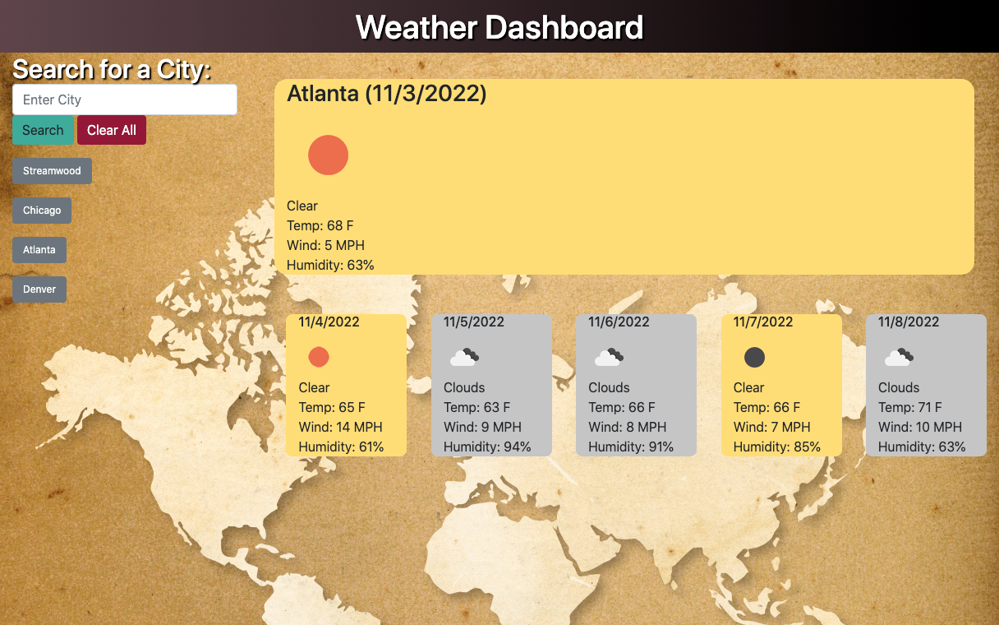

# Module-6-Challenge-Weather-Dashboard
A weather dashboard that displays the current weather and the weather forecast for the next five days.

Server side api for weather was utilized, and the page is dynamically updated with retrieved information.

HTML, CSS, JS with Bootstrap, Jquery were employed to build this application.

## <u>Table of Contents</u>
1. [Deployed Page](#deployed-page)
2. [Web Application Features](#web-application-features)
3. [Screenshot](#screenshot)
4. [Sources](#sources)

## <u>Deployed Page</u>

[Weather Dashboard](https://iwirsing.github.io/Module-6-Challenge-Weather-Dashboard/) 

## <u>Web Application Features</u>

1. The user enters a city and the application displays the current weather using icons and a few parameters.
2. The background color of the day's forecast changes according to the weather. A clear would get a shade of yellow, rain would get a share of purple while clouds would get a shade of gray.
3. Every time the user searches the weather for a city, the city is saved in the localStorage and also displayed as a button for the user to access the weather in the future.
4. If the user searches for a city that has already been searched, the application will create an alert that it already has been searched.
5. A 'Clear Saved Data' button appears when searched cities start to populate the page. This button will clear the saved cities and also the data in the localStorage.

## <u>Screenshot</u>

## <u>Sources</u> 
1. https://getbootstrap.com/docs/4.5/getting-started/introduction/
2. https://momentjs.com/
3. https://stackoverflow.com
5. https://developer.mozilla.org/en-US/

